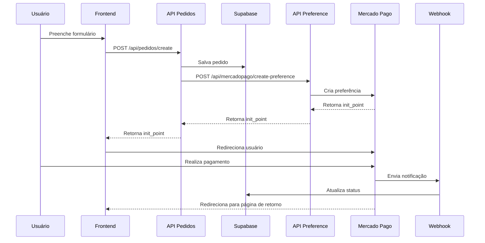

# 🚀 Integração com Mercado Pago - Guia Completo

## 📋 Visão Geral

Este projeto implementa integração completa com a API do Mercado Pago usando o SDK oficial. O sistema cria preferências de pagamento dinamicamente baseadas nos lotes configurados no banco de dados.

## ✨ Funcionalidades

- ✅ Criação dinâmica de preferências de pagamento
- ✅ **Métodos de pagamento: PIX e Boleto apenas**
- ✅ Webhook para atualização automática de status
- ✅ Páginas de retorno personalizadas (sucesso, pendente, falha)
- ✅ Valores sempre sincronizados com o banco de dados
- ✅ Segurança: cálculos de preço apenas no backend
- ✅ Rastreamento completo de pagamentos

## 🗂️ Arquitetura

```
app/
├── api/
│   ├── mercadopago/
│   │   ├── create-preference/route.ts  # Cria preferência de pagamento
│   │   └── webhook/route.ts            # Recebe notificações do MP
│   └── pedidos/
│       └── create/route.ts             # Cria pedido e preferência
├── pagamento/
│   ├── sucesso/page.tsx                # Página de pagamento aprovado
│   ├── pendente/page.tsx               # Página de pagamento pendente
│   └── falha/page.tsx                  # Página de pagamento rejeitado
└── inscricao/page.tsx                  # Formulário de inscrição

database/
└── adicionar_campos_mercadopago.sql    # Script de atualização do schema
```

## 🔧 Configuração

### 1. Instalar dependências

```bash
npm install mercadopago
```

### 2. Configurar variáveis de ambiente

Copie `.env.example` para `.env.local` e preencha:

```env
# Mercado Pago
MERCADOPAGO_ACCESS_TOKEN=seu_access_token
NEXT_PUBLIC_MERCADOPAGO_PUBLIC_KEY=sua_public_key

# URL do aplicativo
NEXT_PUBLIC_APP_URL=http://localhost:3000
```

**Como obter credenciais:**

1. Acesse [Mercado Pago Developers](https://www.mercadopago.com.br/developers/panel/app)
2. Crie ou selecione uma aplicação
3. Copie as credenciais de **Teste** ou **Produção**

### 3. Atualizar banco de dados

Execute no **Supabase SQL Editor**:

```sql
-- Adicionar campos para Mercado Pago
ALTER TABLE pedidos
ADD COLUMN IF NOT EXISTS mercadopago_payment_id TEXT,
ADD COLUMN IF NOT EXISTS mercadopago_status TEXT;

-- Criar índice
CREATE INDEX IF NOT EXISTS idx_pedidos_mercadopago_payment_id
ON pedidos(mercadopago_payment_id);
```

Ou use o script:

```bash
# Execute no Supabase SQL Editor
cat database/adicionar_campos_mercadopago.sql
```

### 4. Configurar Webhook no Mercado Pago

1. Acesse [Mercado Pago Developers](https://www.mercadopago.com.br/developers/panel/app)
2. Vá em **Webhooks** → **Configuração**
3. Adicione a URL: `https://seu-dominio.com/api/mercadopago/webhook`
4. Selecione eventos: **Pagamentos**
5. Salve

> **Desenvolvimento local:** Use [ngrok](https://ngrok.com/) ou [localtunnel](https://localtunnel.github.io/www/) para expor localhost

## 🔄 Fluxo de Pagamento



## 🎨 Páginas de Retorno

### Sucesso (`/pagamento/sucesso`)

- ✅ Exibida quando pagamento é aprovado
- Mostra ID do pedido
- Informa sobre e-mail de confirmação

### Pendente (`/pagamento/pendente`)

- ⏱️ Exibida quando pagamento está pendente
- Informa tempo de espera (boleto, PIX, etc.)
- Avisa sobre e-mail futuro

### Falha (`/pagamento/falha`)

- ❌ Exibida quando pagamento é rejeitado
- Lista possíveis motivos
- Oferece opção de tentar novamente

## 🔐 Segurança

### Validações Implementadas

1. **Backend-only pricing:**

   - Preços calculados apenas no servidor
   - Frontend não envia `valor_total`

2. **Validação de dados:**

   - Todos os campos obrigatórios verificados
   - Valores mínimos respeitados

3. **Webhook seguro:**
   - Verifica tipo de notificação
   - Consulta API do MP para validar dados
   - Atualiza apenas pedidos existentes

## 📊 Mapeamento de Status

| Status Mercado Pago | Status Sistema |
| ------------------- | -------------- |
| `approved`          | Pago           |
| `pending`           | Pendente       |
| `in_process`        | Pendente       |
| `rejected`          | Cancelado      |
| `cancelled`         | Cancelado      |
| `refunded`          | Cancelado      |
| `charged_back`      | Cancelado      |

## 🧪 Testando a Integração

### Modo de Teste

Use credenciais de **TESTE** para testar sem dinheiro real.

**PIX (Teste):**

- O Mercado Pago gera um QR Code de teste
- Você pode usar a conta de teste para simular pagamento
- Status é atualizado automaticamente

**Boleto (Teste):**

- Gera um código de barras de teste
- Use a opção "Simular pagamento" no painel do Mercado Pago
- Status é atualizado após simulação

**Cartões de teste (DESABILITADO):**

> ⚠️ Cartões de crédito/débito foram desabilitados. Apenas PIX e Boleto são aceitos.

[Mais informações sobre testes](https://www.mercadopago.com.br/developers/pt/docs/checkout-api/testing)

### Testando Webhook Localmente

```bash
# Instalar ngrok
npm install -g ngrok

# Expor localhost
ngrok http 3000

# Copie a URL pública e configure no Mercado Pago
# Exemplo: https://abc123.ngrok.io/api/mercadopago/webhook
```

## 🚀 Deploy em Produção

### 1. Atualizar variáveis de ambiente

```env
# Use credenciais de PRODUÇÃO
MERCADOPAGO_ACCESS_TOKEN=APP_USR-...
NEXT_PUBLIC_MERCADOPAGO_PUBLIC_KEY=APP_USR-...

# URL real do site
NEXT_PUBLIC_APP_URL=https://seu-dominio.com
```

### 2. Configurar webhook

Atualize URL do webhook para:

```
https://seu-dominio.com/api/mercadopago/webhook
```

### 3. Testar fluxo completo

1. Fazer inscrição de teste
2. Verificar criação de preferência
3. Realizar pagamento teste
4. Confirmar atualização via webhook
5. Validar páginas de retorno

## 📝 Logs e Monitoramento

### Console Logs Implementados

- ✅ `Preferência criada:` - Quando preferência é criada
- 📥 `Webhook recebido:` - Quando webhook é acionado
- 🔄 `Atualizando pedido:` - Quando status é atualizado
- ❌ `Erro ao...` - Qualquer erro no processo

### Verificar Status no Admin

O painel administrativo mostra:

- `mercadopago_payment_id`: ID do pagamento no MP
- `mercadopago_status`: Status original do MP
- `status_pagamento`: Status mapeado para o sistema

## 🐛 Troubleshooting

### Webhook não está funcionando

1. Verifique se URL está acessível publicamente
2. Teste URL manualmente: `curl https://seu-dominio.com/api/mercadopago/webhook`
3. Verifique logs no Supabase
4. Confirme configuração no painel do MP

### Pagamento não atualiza automaticamente

1. Verifique se webhook está configurado
2. Consulte logs do webhook
3. Tente atualizar manualmente via painel admin

### Erro "Access Token inválido"

1. Verifique se copiou token completo
2. Confirme se está usando credenciais corretas (teste/produção)
3. Gere novo token se necessário

## 📚 Documentação Adicional

- [Mercado Pago - Preferências](https://www.mercadopago.com.br/developers/pt/docs/checkout-pro/preferences)
- [Mercado Pago - Webhooks](https://www.mercadopago.com.br/developers/pt/docs/notifications/webhooks)
- [SDK Node.js](https://github.com/mercadopago/sdk-nodejs)

## 🎯 Próximos Passos

- [ ] Implementar retry automático de webhook
- [ ] Adicionar notificações por e-mail
- [ ] Dashboard de métricas de pagamento
- [ ] Suporte a múltiplos métodos de pagamento
- [ ] Geração de comprovantes em PDF
